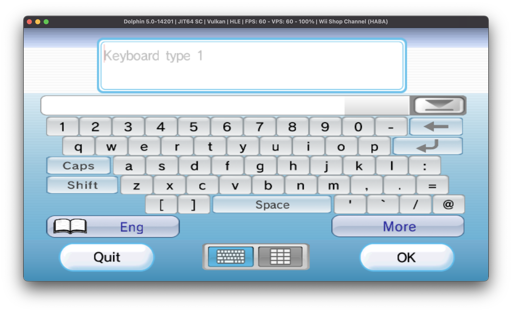
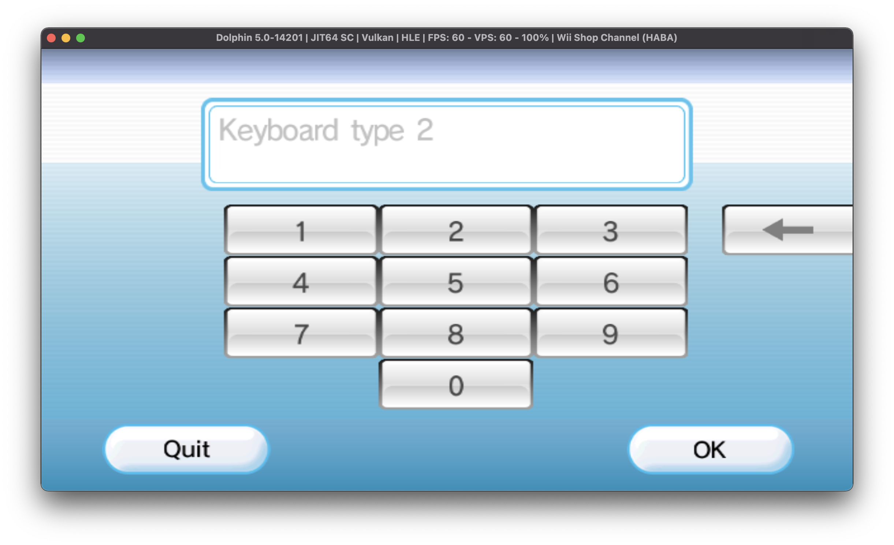
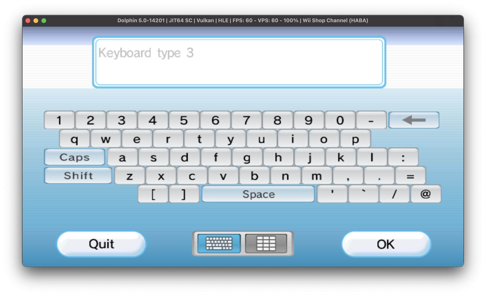
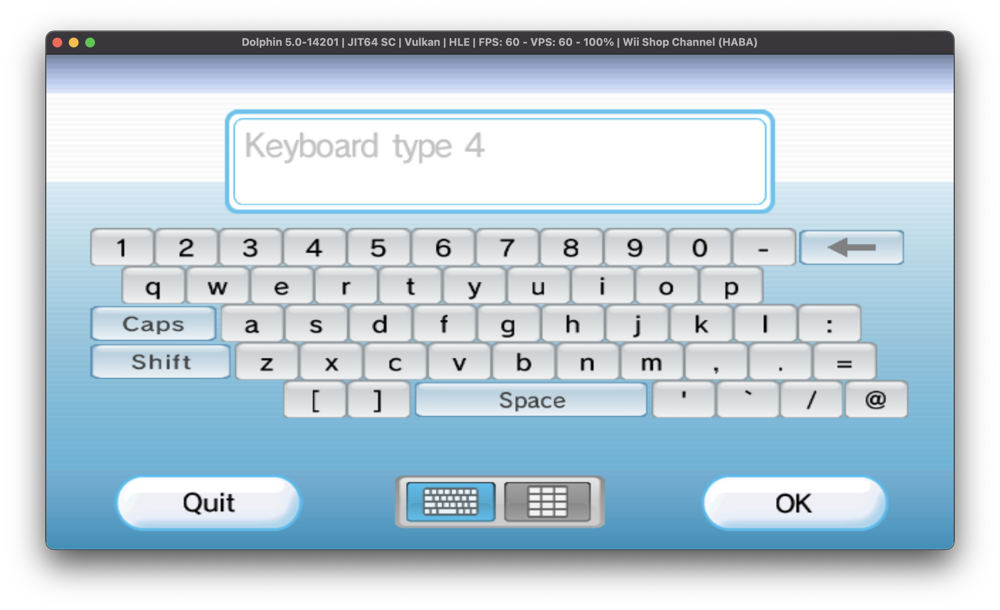
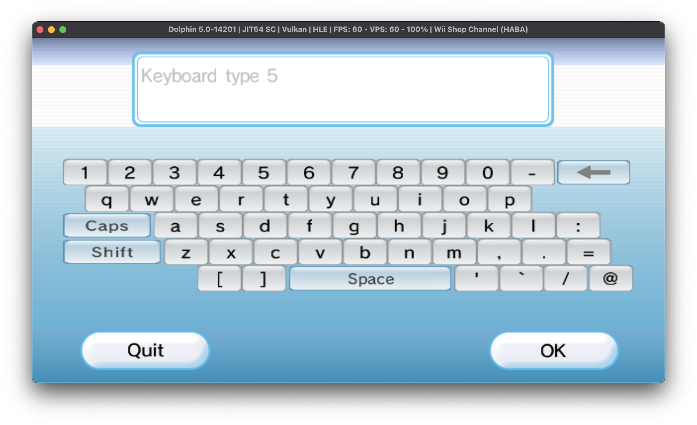
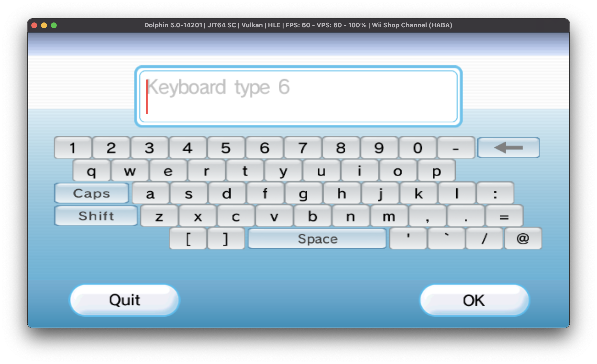
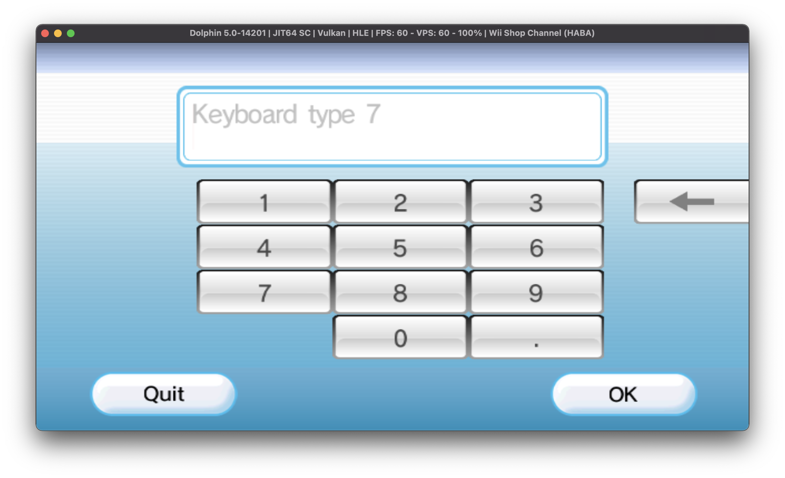
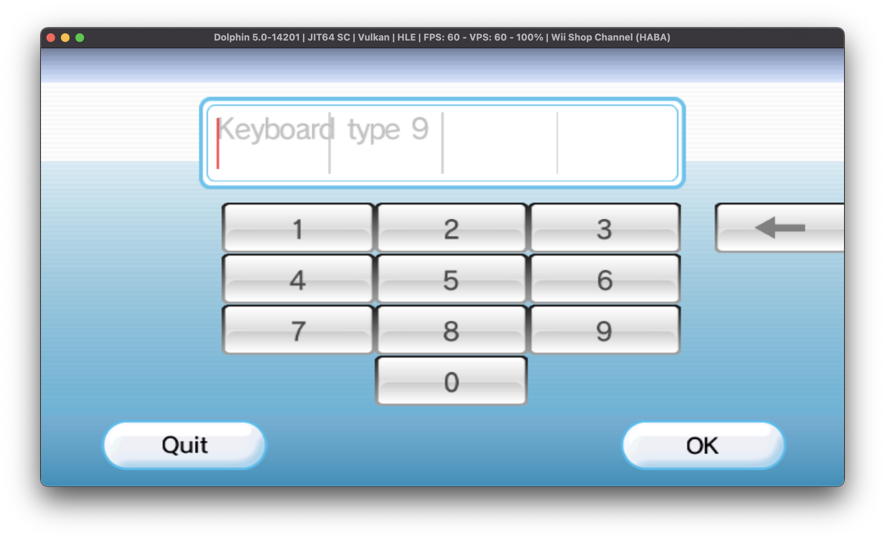
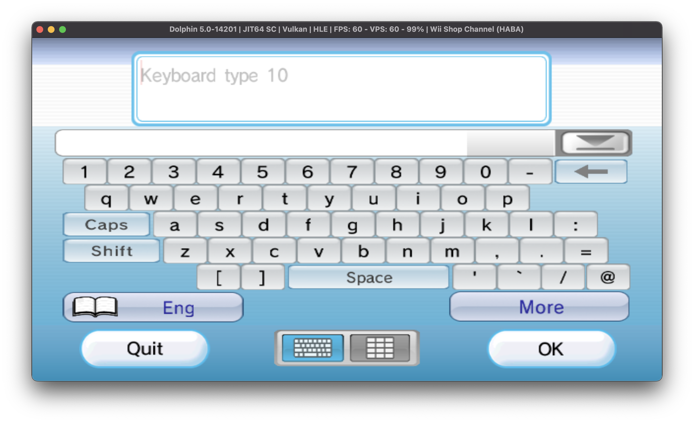

# Keyboard

You interact with the keyboard using `wiiKeyboard`. When you use the keyboard, you have options to configure its layout.

When you use the keyboard in any capacity, your page must be over HTTPS.

## Functions

| Method | Description |
| :--- | :--- |
| `call(type, rowLimit, isPassword, title)` | Presents the keyboard. |

When you call the keyboard, you must present four arguments:

* `type`, the type of keyboard you want. See [Keyboard Types](keyboard.md#keyboard-types) for more information.
* `rowLimit`, the numerical amount of rows the user should be able to type.
* `isPassword`, a boolean on whether this textbox is treated as a password field. If so, its contents will be visually replaced by bullet points shortly after input.
* `title`, the string overlayed as a hint for entry. 

## Keyboard Types

All IDs outside of this range default to type 1.

<table>
  <thead>
    <tr>
      <th style="text-align:left">ID</th>
      <th style="text-align:left">Keyboard Type</th>
    </tr>
  </thead>
  <tbody>
    <tr>
      <td style="text-align:left">1</td>
      <td style="text-align:left">A generic keyboard with autocomplete and line return.
         
        
      </td>
    </tr>
    <tr>
      <td style="text-align:left">2</td>
      <td style="text-align:left">
        
A number pad.

        

          
        

      </td>
    </tr>
    <tr>
      <td style="text-align:left">3</td>
      <td style="text-align:left">
        
A generic keyboard without autocomplete and line return.

        

          
        

      </td>
    </tr>
    <tr>
      <td style="text-align:left">4</td>
      <td style="text-align:left">
        
Large text entry without autocomplete and line return.

        

          
        

      </td>
    </tr>
    <tr>
      <td style="text-align:left">5</td>
      <td style="text-align:left">
        
A generic keyboard without autocomplete, line return and the option to
          switch to a number pad.

        

          
        

      </td>
    </tr>
    <tr>
      <td style="text-align:left">6</td>
      <td style="text-align:left">
        
Large text entry without autocomplete, line return and the option to switch
          to a number pad.

        

          
        

      </td>
    </tr>
    <tr>
      <td style="text-align:left">7</td>
      <td style="text-align:left">
        
A number pad with a dot.

        

          
        

      </td>
    </tr>
    <tr>
      <td style="text-align:left">8</td>
      <td style="text-align:left">
        
Large text entry with the number pad with a dot.

        

          
        

      </td>
    </tr>
    <tr>
      <td style="text-align:left">9</td>
      <td style="text-align:left">
        
Large text entry, separated into 4 quadrants for Wii friend codes.

        

          
        

      </td>
    </tr>
    <tr>
      <td style="text-align:left">10</td>
      <td style="text-align:left">
        
A generic keyboard with autocomplete but no line return.

        

          
        

      </td>
    </tr>
  </tbody>
</table>

